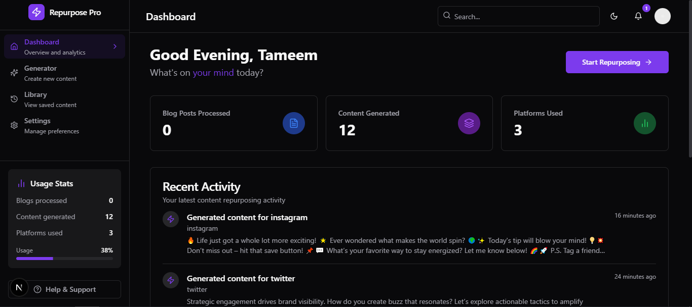

# AI-Powered Content Repurposing Platform

## 🧠 The Problem
Creators waste hours repurposing content manually. This tool needed to automate that while preserving tone and brand.

## 🚀 The Solution
I developed a **Full-Stack AI-powered platform** that turns blog posts into short-form content for multiple social platforms—while keeping the brand voice intact.

### ✅ Features Include:
- AI-powered repurposing  
- Content management  
- Platform-specific formatting  
- AI Content Score & advanced customization options  
- Secured Authentication (Google Auth)  
- Notifications, Dark/Light mode switch, and more  

All from a **central dashboard**, built with **Next.js, TypeScript, Three.js**, and **OpenRouter APIs**.

I focused on **speed, scalability, and simplicity** to deliver real value to solo creators and teams.

## 📚 What I Learned
I learned how to integrate powerful AI features while keeping the UX intuitive. Balancing automation, scalability, and simplicity was key to creating real value for creators.

## 🔗 https://repurpose-pro.vercel.app/

---

## 🏷 Tags:
#WebDevelopment  
#FullStackDeveloper  
#saas  
#aisaas  
#creativecoding  
#buildinpublic  
#Nextjs  
#TypeScript  
#TailwindCSS  
#Supabase
